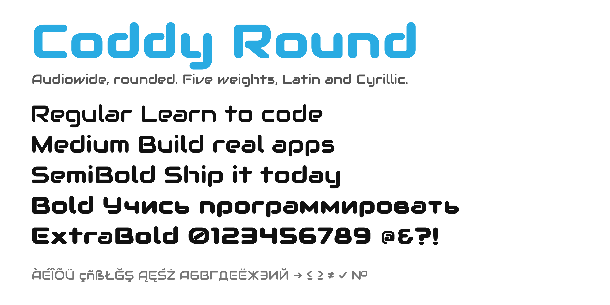

# Coddy Round



Coddy Round is [Audiowide](https://fonts.google.com/specimen/Audiowide) with every sharp outer corner rounded, the way the [Coddy](https://coddy.tech) wordmark is drawn. The weight, proportions and curves are Audiowide's own; each outer corner is filleted with a radius of half the stem, so every stroke ends in a half circle, and the inner corners stay crisp.

It is the display typeface of [coddy.tech](https://coddy.tech), where it sets the logo and headlines.

## Weights and coverage

Five weights, drawn rather than synthesized: Regular 400, Medium 500, SemiBold 600, Bold 700 and ExtraBold 800. Each heavier weight is an outward offset of Audiowide's outlines, vertical strokes more than horizontal ones, with the baseline, x-height and cap height held in place and Audiowide's designed slits (the detached arm of E, the bowl of d, the slot of a) kept open, then the same rounding.

Latin covers Western, Central and Eastern European languages and Turkish. Cyrillic covers Russian, plus Є І Ї; the Cyrillic letters Audiowide never had are drawn from its own parts and stroke. A few symbols are included too: → ← ↑ ↓ ≤ ≥ ≠ ✓ №.

## Download and use

Download the latest release from the [Releases page](https://github.com/coddytech/coddy-round/releases), or take the files straight from this repository:

- `fonts/ttf/` for desktop apps and design tools
- `fonts/webfonts/` for the web

On the web:

```css
@font-face {
    font-family: 'Coddy Round';
    font-weight: 400;
    font-display: swap;
    src: url('CoddyRound-Regular.woff2') format('woff2');
}

@font-face {
    font-family: 'Coddy Round';
    font-weight: 700;
    font-display: swap;
    src: url('CoddyRound-Bold.woff2') format('woff2');
}

h1 {
    font-family: 'Coddy Round', sans-serif;
}
```

## Building

The fonts are built from Audiowide by a Python script, in one step:

```sh
python3 -m venv venv && . venv/bin/activate
pip install -r requirements.txt
./build.sh
```

`build.sh` writes `fonts/ttf/` and `fonts/webfonts/` and `OFL.txt`. The build is deterministic: the same sources give byte-identical fonts.

```
build.sh           builds everything
requirements.txt   pinned Python dependencies
sources/
  build.py         the build: merge, draw each weight, name, write
  weights.py       how a heavier weight is drawn
  geometry.py      outline maths: rounding, offsetting, curve fitting
  additions.py     the Cyrillic alphabet and symbols Audiowide lacks
  ofl-body.txt     the license text OFL.txt is written from
  upstream/        Audiowide, which Coddy Round is built from
fonts/             the built fonts
documentation/     specimen and description
```

## License

Coddy Round is licensed under the SIL Open Font License, Version 1.1, and is free to use, modify and redistribute under its terms. See [OFL.txt](OFL.txt).

It is a Modified Version of Audiowide, Copyright (c) 2012 Brian J. Bonislawsky DBA Astigmatic (AOETI). "Audiowide" is a Reserved Font Name, which is why this family has its own name.

## Credits

- Audiowide, the design: Brian J. Bonislawsky, [Astigmatic](http://www.astigmatic.com)
- Coddy Round: [Coddy](https://coddy.tech)

Issues and suggestions are welcome. The fonts are developed in Coddy's codebase and published here with each release.
